# DAO Treasury MVP 架构图和时序图

这份图描述当前 MVP，而不是最终 hardfork 设计。当前版本的核心思路是：

1. CKB 链只承载可验证的 governance cells：Proposal Session Cell 和 Vote Cell。
2. proposal 正文、snapshot index、proof、tally report 是链下 artifact，但都被链上或公开 root/hash 承诺。
3. Rust Tally service 是便利层，不是可信方。任何人都可以重放链、重算 snapshot、重扫 vote window、重算 tally root。

## MVP 系统分层

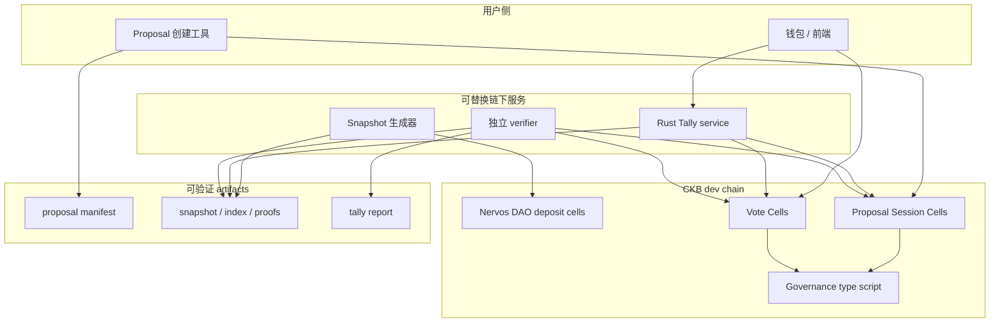

这张图只表达分层关系，不表达所有数据字段。关键边界是：Tally service 可以下线、换人运营或被多个团队同时运行；它提供的是查询和索引便利，不提供最终可信性。最终可信性来自链上 cells、公开 artifacts 的 hash/root，以及 verifier 的可重算性。

## 核心数据流

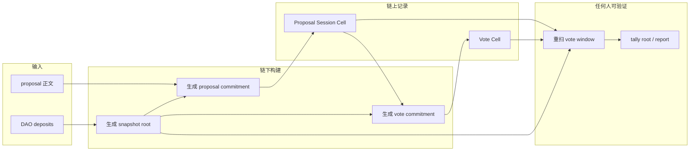

这个图按时间顺序看：先从 DAO deposits 生成 snapshot，再创建 proposal，然后钱包基于 snapshot proof 创建 vote，最后任何人都可以重扫链得到同一个 tally root。

## 链上和链下数据边界

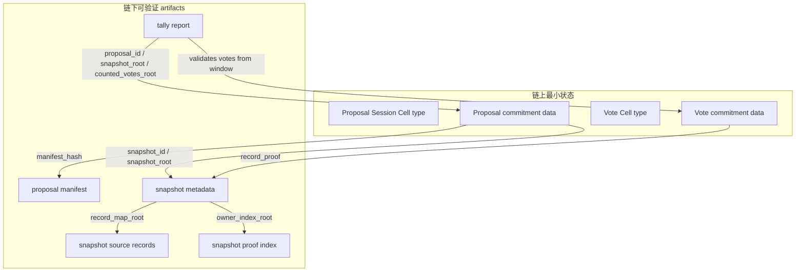

因此一个 proposal 的完整含义不是只靠链上 data 表达，而是：

```text
Proposal Session Cell
  + manifest_hash 对应的 manifest
  + snapshot_id / snapshot_root 对应的 snapshot
  + vote window 内的 typed Vote Cells
  + 可重算的 tally report
```

## Demo 端到端流程

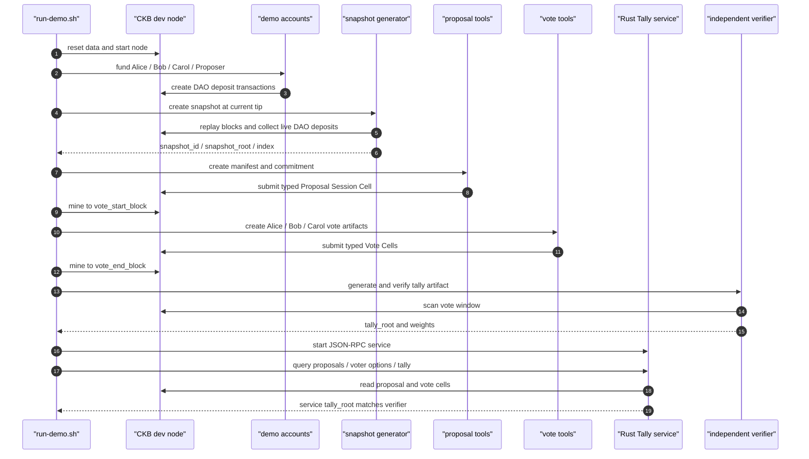

当前 demo 的最终结果是 `yes = 70,000 CKB`，`no = 45,000 CKB`，service 计算出的 `tally_root` 与独立 verifier 一致。

## Snapshot 生成和验证

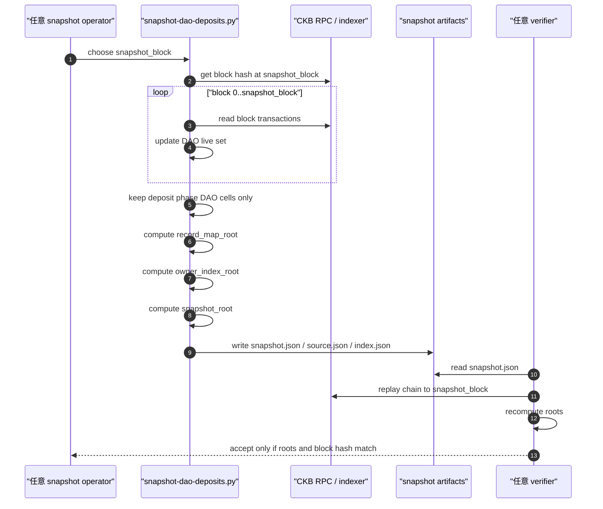

在主网方向，这个流程不应该每次从 genesis 重扫。更实际的做法是让 snapshot/indexer 长期增量维护 DAO live set，并为每个投票周期导出 checkpoint 与 snapshot；但是验证逻辑仍然应该能从可信 checkpoint 或 full replay 重算出来。

## Proposal 创建和发现

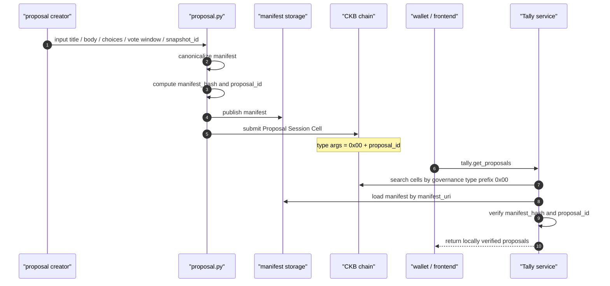

这里 proposal 正文可以很长，不需要全部上链。链上只需要存 commitment；钱包展示时必须校验 `manifest_hash`，否则就不能把该 proposal 当作已验证内容展示。

## Voter Options 查询

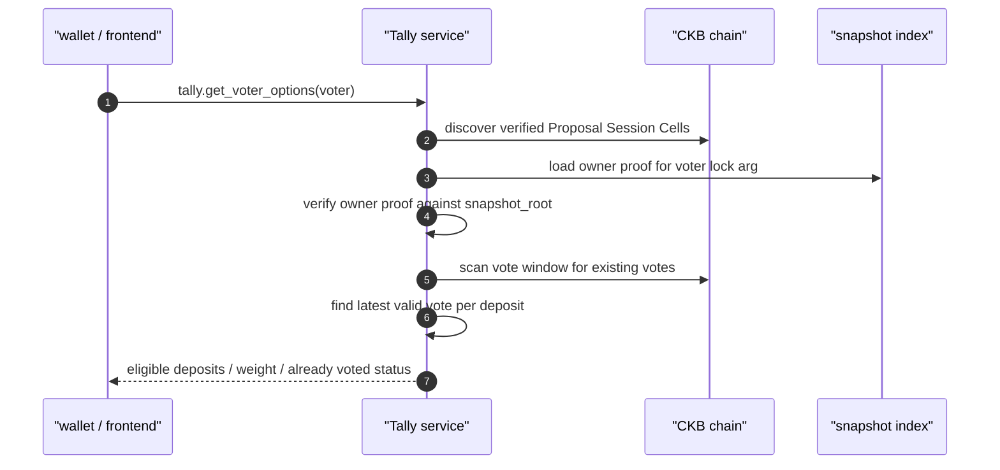

钱包判断一个 DAO live cell 能否投某个 proposal，需要同时满足：

1. deposit 出现在该 proposal 引用的 snapshot record set 中。
2. 对应 record proof 能通过 `snapshot_root` 验证。
3. 当前 voter 能证明自己控制 record 里的 lock。
4. vote block 位于 proposal 的投票窗口内。

## 投票提交

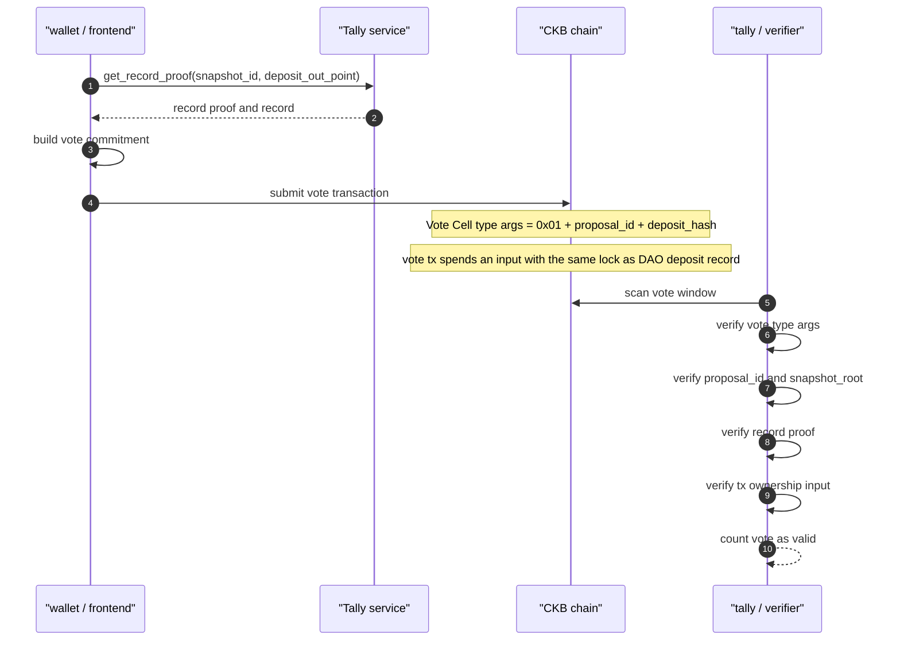

当前 MVP 不要求 vote tx 花掉 DAO deposit cell 本身。用户在 snapshot 后取出 DAO deposit，不会影响已经针对该 snapshot 投出的 vote，因为权重在 snapshot block 固定。

## Tally 和独立验证

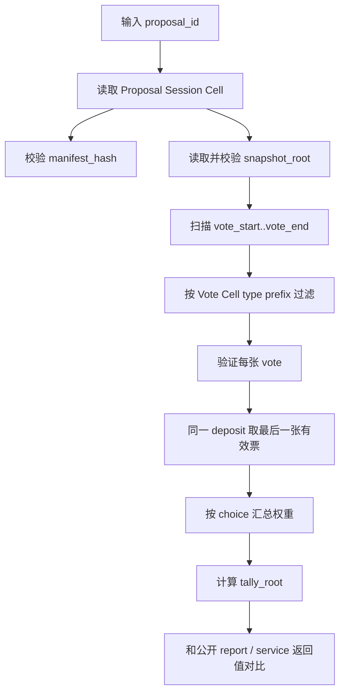

单张 vote 的验证条件：

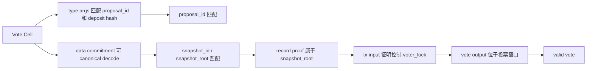

## zkVM Settlement PoC

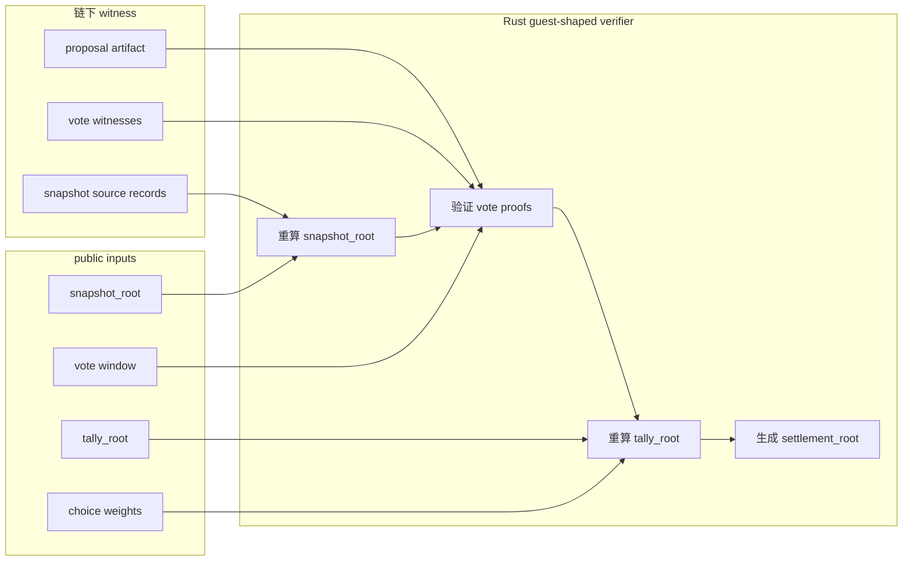

当前 PoC 已经验证 transcript 内部一致性，并且会重算 witnessed blocks / transactions 的 CKB 原生 commitments。下一步要把 transaction inclusion proof、可信 header anchoring、checkpoint transition 加进 witness，让 settlement proof 能证明这些输入来自 canonical CKB chain。

当前这版相对前一步已经多验证了两层关键约束：除了 vote transaction、`containing_block`、`owner_input_cells` 和带首尾 anchors 的 `header_chain_witness` 之外，guest-shaped verifier 还会用 CKB 原生规则重算 header hash、`transactions_root`、`proposals_hash`、`extra_hash` 和 tx hash。也就是说，它现在不只是验证这些 JSON witness 互相能对上，而是验证它们满足 CKB block / tx 的结构承诺。

## 长期韧性目标和当前 MVP 的差距

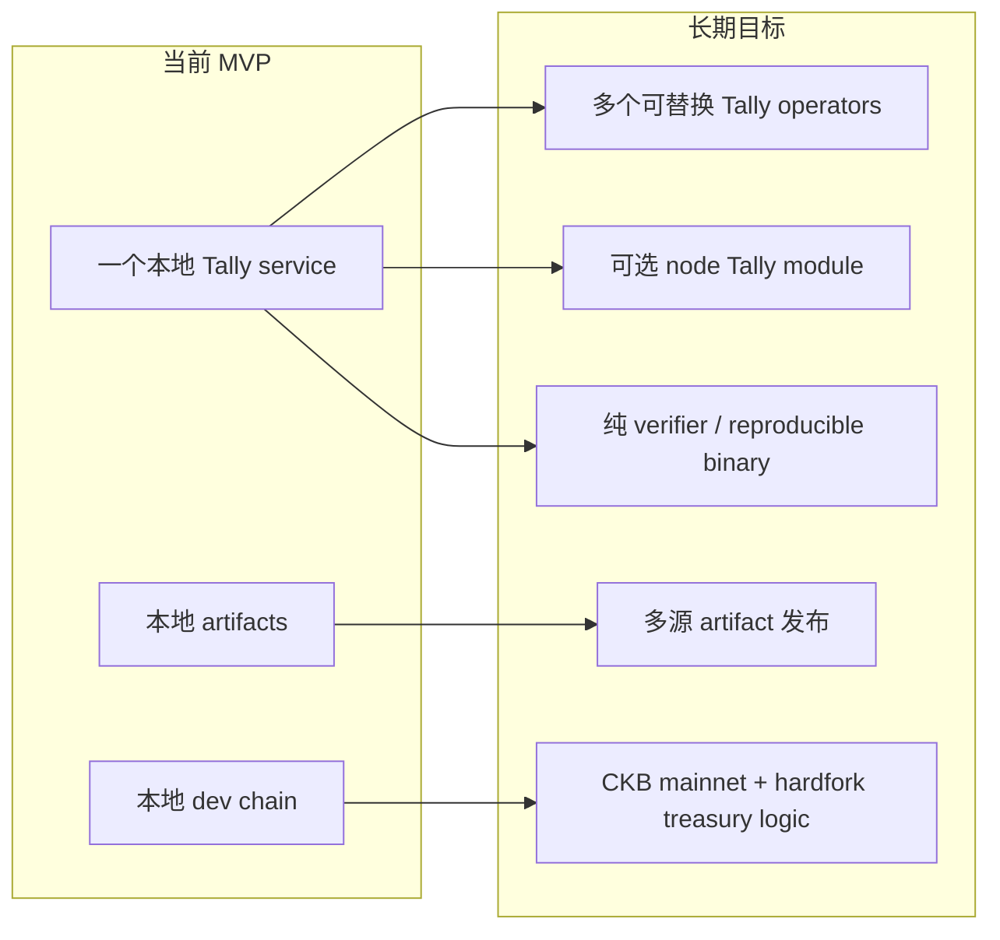

下一步最重要的工程拆分是把 Rust Tally service 中的“纯验证核心”独立成 library。service、CLI verifier、未来可选 CKB node module 都调用同一个 core，这样可以减少实现分叉，也更容易做到 independently verifiable。
