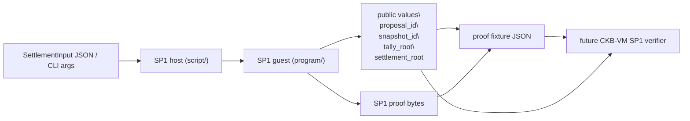
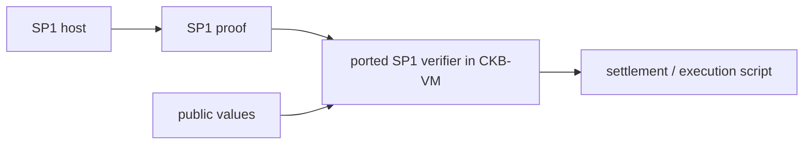

# SP1 Smoke Integration Notes

## Goal

This smoke test is not the final voting settlement proof.

It exists to validate one concrete path:

```text
SP1 guest
  -> emits proof + public values
  -> CKB-VM side verifier can later consume the same proof artifact
```

## Current statement being proved

The guest proves only a tiny deterministic statement:

```text
given:
  proposal_id
  snapshot_id
  tally_root

compute:
  settlement_root = ckb_hash(proposal_id || snapshot_id || tally_root)

commit as public values:
  proposal_id
  snapshot_id
  tally_root
  settlement_root
```

This is intentionally small. It gives us a proof object with the same outer shape we will need for
real settlement later:

```text
witness in
deterministic guest execution
public values out
proof generated by host
proof verified off-chain first
proof later verified in CKB-VM
```

## Wiring



## Mapping to the real DAO treasury flow

The final voting design will replace the tiny smoke input with the real settlement transcript:

```text
today:
  proposal_id
  snapshot_id
  tally_root

later:
  proposal commitment
  snapshot commitment
  snapshot source or checkpoint transition witness
  vote witnesses
  header / inclusion witness
```

The final guest will not just hash three values. It will:

```text
1. validate the settlement transcript
2. recompute snapshot_root
3. recompute tally_root
4. derive settlement_root
5. commit final public values
```

So the smoke test is mainly proving that the outer integration boundary is sound:

```text
host/guest split
proof generation
public value encoding
artifact export for a future CKB-VM verifier
```

## Relationship with XuJiandong's CKB-VM verifier port

The forked verifier work means we likely have this eventual path:



What this smoke test gives us is the left half of that picture.

What it does not do yet:

```text
- prove the full voting transcript
- verify anything inside CKB-VM
- connect proof public values to an on-chain typed settlement cell
```

## Current checkpoint

What we have already confirmed locally:

```text
1. the SP1 guest can be compiled with the succinct toolchain
2. execute mode returns the expected 128-byte public values
3. core proof generation + verification works end to end
4. plonk mode starts correctly and begins downloading the required plonk artifacts
```

## Next steps after the smoke path is stable

```text
1. replace the tiny guest input with the existing zkvm transcript verifier core
2. keep the same public value envelope
3. export a fixture that matches the CKB-VM verifier's expected input layout
4. build a minimal CKB script demo that checks one SP1 proof
```
