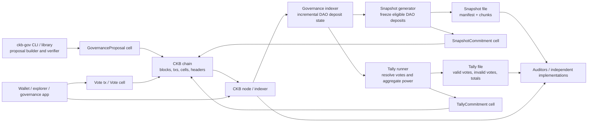
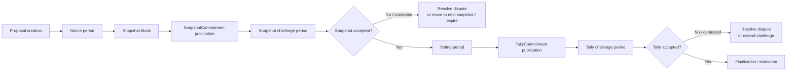
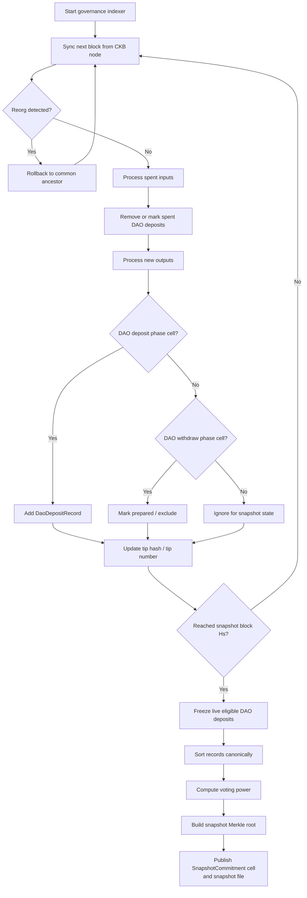
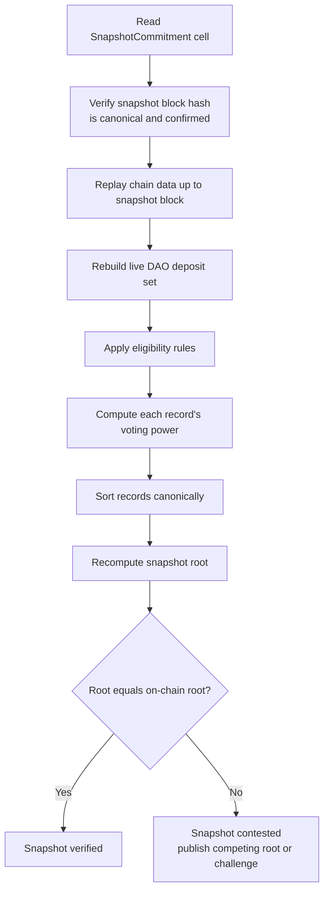
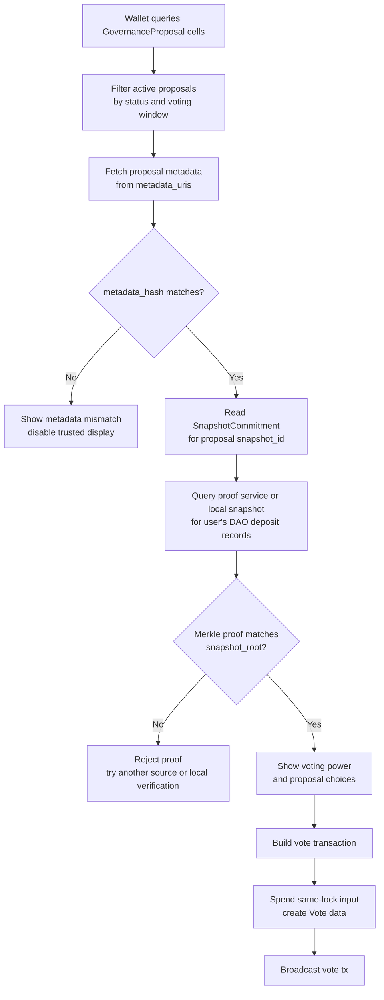
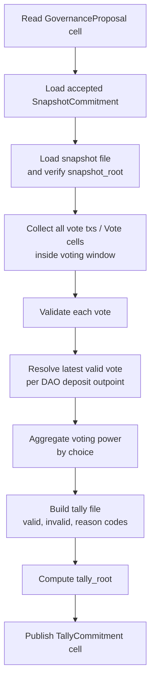
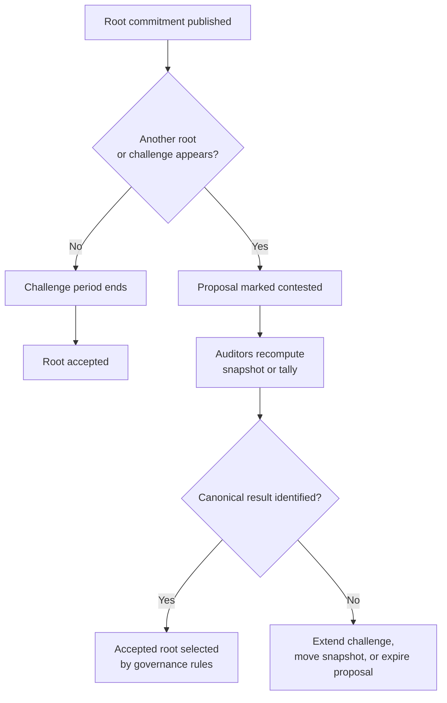

# CKB DAO Treasury Governance V1 Design Note

本文是关于 CKB 国库激活与 DAO snapshot voting 的团队讨论稿。它不是最终 RFC，也不是实现规范，而是用于统一设计方向、明确边界和沉淀开放问题的 design note。

本文关注两个相关但应当解耦的方向：

1. **Treasury activation**：让未来属于 community treasury 的 secondary issuance 进入可治理的链上资金池。
2. **Governance voting V1**：使用 Nervos DAO deposit 作为投票权来源，采用可独立复算的 off-chain tally，先建立一个现实可部署的治理流程。

## 1. Executive Summary

建议 V1 不追求完全链上计票，而是采用 **independently verifiable off-chain tally**：

```text
公开链数据
+ 确定性 snapshot 规则
+ 确定性 vote/tally 规则
+ 开源 reference tools
= 任何人都可以独立复算同一个结果
```

这条路线的核心取舍是：

```text
保留现有 DAO deposit 的 UX
降低协议和脚本复杂度
接受 tally 不由 CKB script 自执行
通过公开数据、commitment、challenge period 和多方复算获得可信度
```

V1 建议的范围：

```text
No delegation
No proxy vote
One fixed snapshot per proposal
Only DAO deposit phase cells are eligible
On-chain proposal discovery
On-chain snapshot root commitment
On-chain vote data availability
On-chain tally root commitment
Off-chain deterministic snapshot/tally tools
Challenge periods
Metadata hash commitment
Reference ckb-gov CLI/library
```

V1 暂缓：

```text
DRep / delegation
fully on-chain tally
ZK proof
fraud proof
historical burned treasury activation
continuous re-snapshot during proposal lifetime
arbitrary treasury execution
```

## 2. Goals and Non-Goals

### 2.1 Goals

V1 的目标：

1. 让钱包、explorer、governance app 可以从链上发现可投票 proposals。
2. 使用 Nervos DAO deposit 作为投票权来源。
3. 不要求现有 DAO deposit withdraw / redeposit。
4. 不支持代理投票，先只做直接投票。
5. 通过 snapshot 固定 proposal 的投票权集合。
6. 让 snapshot 和 tally 可以被任何人独立复算。
7. 将 proposal 长文本、附件、snapshot 文件、tally 文件放链下，但用链上 hash/root commitment 防篡改。
8. 提供 reference tool 帮助任何人创建 proposal、生成 snapshot、复算 tally。

### 2.2 Non-Goals

V1 不解决：

1. CKB script 自动验证 tally 并直接释放 treasury。
2. 所有 governance 状态完全链上自包含。
3. DAO deposit 在投票期间被强制锁定。
4. delegation / DRep / proxy vote。
5. 对 snapshot/tally challenge 做链上自动裁决。
6. 历史 burned treasury 的重新激活。
7. 任意复杂 treasury execution。

## 3. Design Principles

### 3.1 Separate Treasury Activation from Voting

Treasury activation 是共识层改动；voting/tally 是治理协议。两者应分开设计和评审。

```text
Treasury activation:
  改变 future secondary issuance 的去向
  需要 hard fork 级别规则变更

Governance voting:
  定义谁能投票、如何投票、如何统计、如何挑战
  V1 可以先不进入共识层
```

### 3.2 Keep V1 Mechanically Simple

第一版应尽量减少动态状态：

```text
fixed snapshot
direct vote only
latest valid vote wins
append-only commitment cells
deterministic off-chain computation
```

### 3.3 Commit On-chain, Store Large Data Off-chain

长 proposal、snapshot 文件、tally 文件不应全部上链。链上只存：

```text
proposal critical fields
metadata hash
snapshot root
tally root
execution payload hash
```

链下内容可以放 IPFS、Arweave、GitHub、Nervos Talk 或社区镜像。只要 hash/root 在链上，链下内容被修改就会被发现。

### 3.4 Publishing Is Not Authority

任何人可以发布 snapshot root 或 tally root。安全性不来自发布者身份，而来自：

```text
确定性规则
公开链数据
开源程序
challenge period
多方独立复算
```

## 4. System Overview

V1 系统由几个独立组件组成：



High-level lifecycle:



## 5. Treasury Activation Track

### 5.1 Current State

当前 CKB 代码中没有 treasury bucket，也没有 treasury cell。

当前 secondary issuance 相关逻辑可以理解为：

```text
g2 = total secondary issuance for a block
miner secondary reward ~= g2 * U / C
non-miner secondary issuance affects DAO accounting through S / AR
cellbase only creates miner reward
```

当前非 genesis cellbase 也有严格限制：

```text
at most one output
empty output data
no type script
```

因此，若要让 treasury 资金成为 live cell，不能只部署脚本；需要修改共识验证逻辑。

### 5.2 Treasury Bucket Concept

`treasury bucket` 是一个拟议的新概念，不是现有代码里的对象。

它表示一段时间内累积的 treasury issuance：

```text
TreasuryBucket {
  range: [start_block, end_block],
  capacity: accumulated_treasury_amount,
  lock: treasury_governance_lock,
  data: bucket_id / range / version
}
```

使用 bucket 的原因：

1. 避免每个 block 产生一个很小的 treasury cell。
2. 避免单一巨大 treasury cell 带来的 spend contention。
3. 让国库资金按周期归档、审计和支出。

### 5.3 Implementation Option A: Cellbase Creates Buckets

在 hard fork 激活后，规定某些 finalization block 的 cellbase 需要额外创建 treasury bucket output：

```text
cellbase output[0] = miner reward
cellbase output[1] = treasury bucket, only when bucket is due
```

需要改动：

```text
Consensus params:
  treasury_activation_epoch
  treasury_bucket_interval
  treasury_lock
  treasury_cell_min_capacity

Reward calculation:
  miner_reward
  treasury_bucket_reward

Cellbase verifier:
  allow treasury output after activation

Reward verifier:
  verify miner output and treasury output separately

DAO accounting:
  subtract issued treasury amount from the relevant accounting bucket
```

优点：

1. 创建位置固定。
2. 节点验证路径直观。
3. 资金生成和区块奖励 finalization 放在同一机制里。

缺点：

1. 需要修改 cellbase 规则。
2. 矿工和 block template 必须适配。
3. 共识改动面较大。

### 5.4 Implementation Option B: Treasury Claim Transaction

另一条路线是引入 treasury claim transaction：

```text
consume TreasuryState cell
create TreasuryBucket cell
output capacity may exceed input capacity by claim_amount
accounting subtracts claim_amount
```

需要：

```text
TreasuryState cell
Treasury claim script
Capacity verifier exception
DAO/treasury accounting update
Bootstrap rule for initial TreasuryState
```

优点：

1. 不需要 cellbase 多 output。
2. bucket 到期后任何人可以 claim。
3. 更灵活。

缺点：

1. 状态机更复杂。
2. 需要特殊 transaction exception。
3. 需要维护唯一 TreasuryState。

### 5.5 Treasury Share Formula

这是 treasury activation 的关键开放问题。

经济模型中，secondary issuance 大致面向三类对象：

```text
occupied capacity -> miner
DAO deposited capacity -> Nervos DAO compensation
liquid / non-deposited capacity -> treasury
```

当前 DAO field 维护：

```text
C: total issuance accounting
S: accumulated non-miner secondary issuance minus DAO withdrawals
U: occupied capacity
AR: accumulated rate
```

但它没有直接维护：

```text
D: live DAO deposits 的 normalized total
```

如果 treasury amount 要严格等于 liquid share，可能需要新增共识派生状态，例如：

```text
dao_normalized_capacity
```

概念上：

```text
DAO deposit 创建:
  add counted_capacity / deposit_ar

DAO deposit 进入 withdraw phase:
  subtract counted_capacity / deposit_ar

miner_share    = g2 * occupied_capacity / total_issuance
dao_share      = g2 * dao_deposited_capacity / total_issuance
treasury_share = g2 - miner_share - dao_share
```

必须仔细处理 rounding，避免影响 DAO withdrawal 的长期可支付性。

## 6. Governance Voting V1

### 6.1 Why Off-chain Tally

CKB 的 cell model 不提供类似账户链的全局 state root。链上脚本很难证明：

```text
某个 DAO deposit 在 snapshot / deadline 时仍然 live
某个 voter 没有更新过 vote
某个 delegation 没有被覆盖
某个 indexer 没有漏掉 eligible cell
```

如果要求 full self-contained on-chain tally，通常需要让治理脚本控制投票权状态和 backing deposit。这会接近 deposit-paired voting 路线，代价是：

```text
现有 DAO deposit 需要 withdraw / redeposit
钱包和生态适配成本高
proposal state cell 可能产生 contention
实现复杂度高
```

V1 选择 off-chain tally，是为了优先得到一个可部署、可复算、UX 友好的治理流程。

### 6.2 Fixed Snapshot

每个 proposal 绑定一个固定 snapshot block：

```text
voting_power(proposal P) = DAO deposit state at snapshot block Hs
```

snapshot 之后：

```text
DAO deposit 被 withdraw / spent
不影响该 proposal 的投票权
```

这是 snapshot governance 的已知 tradeoff。它换来：

1. tally 规则简单。
2. 不需要证明 deposit 在整个 voting window 内持续 live。
3. 用户体验清楚。

未来可以讨论 lookback window：

```text
weight = min(weight at S-3, S-2, S-1, S)
```

但 V1 建议只做 single fixed snapshot。

### 6.3 No Delegation

V1 不支持：

```text
delegation
DRep
proxy vote
vote delegation registry
```

这样可以避免 snapshot 中还需要处理 registration/delegation 最新状态的问题。

## 7. Governance Data Model

### 7.1 GovernanceProposal Cell

Proposal discovery 应该从链上开始。V1 建议定义标准 `GovernanceProposal` cell。

示例字段：

```text
GovernanceProposal {
  version
  proposal_id
  kind
  created_at_block
  proposer_lock_hash
  snapshot_policy
  voting_start
  voting_end
  choices
  threshold_policy
  execution_payload_hash
  metadata_hash
  metadata_uris
  bond_info
}
```

链上字段应覆盖所有会影响投票语义和执行结果的内容。

V1 choices 建议固定：

```text
Approve / Reject / Abstain
```

或：

```text
Yes / No / Abstain
```

### 7.2 Proposal Metadata

长文本和附件不应全部上链。链下 metadata 可以包含：

```text
title
summary
motivation
specification
rationale
risks
budget details
recipient information
discussion links
references
attachments
```

链上保存：

```text
metadata_hash = blake2b(canonical_metadata_bytes)
```

钱包下载 metadata 后必须校验：

```text
blake2b(downloaded_file) == metadata_hash
```

如果 hash 不一致，钱包应显示错误，不能把内容展示为可信 proposal。

### 7.3 Metadata Manifest

如果 proposal 有多个附件，链上不应只承诺一个 Markdown 文件，而应承诺一个 manifest。

示例：

```json
{
  "version": 1,
  "title": "...",
  "summary": "...",
  "body_hash": "0x...",
  "attachments": [
    {
      "name": "budget.csv",
      "media_type": "text/csv",
      "hash": "0x...",
      "uri": "ipfs://..."
    },
    {
      "name": "audit.pdf",
      "media_type": "application/pdf",
      "hash": "0x...",
      "uri": "ipfs://..."
    }
  ]
}
```

需要固定 canonical encoding，例如：

```text
Molecule
canonical CBOR
JCS canonical JSON
```

并明确：

```text
UTF-8
字段顺序
数字编码
hash 算法
换行规范
```

### 7.4 SnapshotCommitment Cell

Snapshot root 发布到链上，形成 canonical commitment。

示例：

```text
SnapshotCommitment {
  version
  proposal_id
  snapshot_block_hash
  snapshot_block_number
  snapshot_root
  eligible_count
  total_voting_power
  rules_hash
  generator_version
  data_uri_hash
}
```

完整 snapshot 文件链下发布：

```text
snapshot manifest
snapshot chunks
Merkle proof data
debug JSON
```

### 7.5 Vote Data

V1 可以使用 on-chain vote data availability。

Vote record 示例：

```text
Vote {
  proposal_id
  snapshot_id
  dao_deposit_outpoint
  choice
}
```

每个 eligible DAO deposit outpoint 是一个 voting unit。

### 7.6 TallyCommitment Cell

投票结束后，任何人可以运行 tally tool 并发布 `TallyCommitment` cell。

示例：

```text
TallyCommitment {
  version
  proposal_id
  snapshot_id
  snapshot_root
  tally_root
  yes_power
  no_power
  abstain_power
  invalid_vote_count
  valid_vote_count
  total_voting_power
  rules_hash
  data_uri_hash
}
```

完整 tally 文件链下发布，包含：

```text
valid votes
invalid votes
latest vote resolution
per-choice aggregation
excluded vote reason codes
```

## 8. Snapshot Model

### 8.1 Snapshot Timing

推荐流程：

```text
proposal created
notice period
snapshot block fixed
snapshot publication window
snapshot challenge window
voting window
```

不要让 snapshot block 到达后立即开始投票。应给 snapshot 生成和社区复算留时间。

例如：

```text
notice period: 7 days
snapshot publication: 1 day
snapshot challenge: 3 days
voting: 7 days
```

如果没有 valid snapshot root：

```text
proposal expires
```

或：

```text
proposal moves to next governance snapshot
```

V1 需要明确选择其中一种，并限制顺延次数。

### 8.2 Eligible DAO Deposit

V1 eligibility 建议：

```text
A cell is eligible if, at snapshot block Hs:

- it is live;
- it has Nervos DAO type script;
- its data is exactly 8 bytes;
- its data value is 0, meaning deposit phase;
- it is not created after Hs;
- it is not spent at or before Hs;
- its capacity is not below occupied capacity.
```

V1 建议不包含 prepared withdrawing cells。

### 8.3 Snapshot Record

每条 snapshot record 包含：

```text
SnapshotRecord {
  out_point
  output_capacity
  output_data_hash
  lock_script
  lock_hash
  deposit_block_hash
  deposit_block_number
  deposit_ar
  snapshot_ar
  voting_power
}
```

排序规则必须固定：

```text
sort by out_point.tx_hash ascending, then output_index ascending
```

### 8.4 Voting Power Formula

候选公式：

```text
Option A:
  voting_power = counted_capacity

Option B:
  voting_power = counted_capacity * AR_snapshot / AR_deposit

Option C:
  voting_power = counted_capacity * AR_0 / AR_deposit
```

其中：

```text
counted_capacity = output.capacity - occupied_capacity(output, output_data)
```

V1 需要在简单性和经济语义之间选择。

`counted_capacity` 的优点：

```text
容易实现
容易解释
容易复算
代表本金权重
```

`counted_capacity * AR_snapshot / AR_deposit` 的优点：

```text
更接近 snapshot 时 DAO deposit 的可赎回经济权重
```

无论选择哪种，都要固定整数除法、精度和 rounding。

### 8.5 Snapshot Generation

Snapshot 不应由 CKB node 共识层生成。V1 推荐独立开源程序生成。

程序不应在 snapshot 到来时从 genesis 临时全量扫描。应使用 continuous indexer：



### 8.6 Snapshot File Format

建议 canonical snapshot 使用：

```text
Molecule
canonical CBOR
fixed binary records
```

人类可读 JSON 只作为 debug artifact。

大文件可 chunk：

```text
snapshot/
  manifest.cbor
  chunks/
    000000.cbor
    000001.cbor
```

manifest 包含：

```text
snapshot_block_hash
snapshot_block_number
rules_hash
record_count
total_voting_power
chunk_size
chunk_roots
snapshot_root
```

## 9. Snapshot Verification

任何人都应能独立验证 SnapshotCommitment。

验证流程：



如果 root 一致，说明 snapshot 与确定性规则一致。

### 9.1 Merkle Proof for Wallets

钱包不一定下载完整 snapshot。它可以向 proof service 查询：

```text
(snapshot_id, user DAO deposit outpoints)
  -> SnapshotRecord + MerkleProof
```

钱包本地验证：

```text
hash(record) + proof == on-chain snapshot_root
```

proof service 可以帮助查询，但不能伪造 included record。

如果 proof service 漏掉用户的 deposit，用户可以切换服务或本地运行工具。

## 10. Vote Model

### 10.1 Direct Vote Only

V1 中：

```text
one eligible DAO deposit outpoint = one voting unit
```

同一个 DAO deposit 对同一个 proposal 可以多次投票，但只有 latest valid vote 生效。

latest 排序规则必须固定，例如：

```text
(block_number, tx_index, output_index)
```

### 10.2 Proof of Control

V1 推荐的 canonical vote 方式：

```text
投票交易不花费 DAO deposit；
但必须花费至少一个普通 input；
该 input 的 lock script 必须等于 snapshot record 中 DAO deposit 的 lock script。
```

Tally 程序检查：

```text
vote tx input contains lock_script == snapshot_record.lock_script
```

优点：

1. 复用 CKB 现有脚本验证。
2. tally 程序不需要实现各种 lock 的签名验证。
3. 用户不需要移动 DAO deposit。

局限：

1. 用户需要有同 lock 的可花费 cell。
2. 对 custom lock 来说，same lock 不一定总是表达同一控制语义。

Off-chain signed vote 可以作为未来扩展，但 V1 不作为主路径。

### 10.3 Valid Vote Rules

Tally 程序验证：

```text
vote is in voting window
proposal_id matches
snapshot_id matches
dao_deposit_outpoint exists in snapshot
choice is valid
vote tx contains matching lock input
latest valid vote wins
```

## 11. Proposal Discovery and Wallet UX

钱包和 explorer 不应依赖某个中心化网页来判断有哪些 proposal。

流程：



钱包列表应能展示：

```text
proposal title
kind
voting window
snapshot status
user voting power
choices
metadata verified / mismatch
```

Proposal detail 页应展示：

```text
on-chain critical fields
metadata content
snapshot block/root
user included DAO deposits
per-deposit voting power
current tally if available
cast/change vote
```

## 12. Tally and Challenge

### 12.1 Tally Computation

Tally 输入：



### 12.2 Challenge Period

V1 的 challenge 可以先是社会可验证流程，不要求链上自动裁决。

Snapshot challenge 类型：

```text
missing eligible cell
ineligible cell included
wrong voting power
wrong AR
wrong sorting
wrong rules hash
```

Tally challenge 类型：

```text
valid vote omitted
invalid vote included
latest vote resolution wrong
wrong choice aggregation
wrong voting power
wrong window check
```

可以允许提交 `Challenge` cell 作为链上证据锚点，但 V1 不承诺 CKB script 自动裁决 challenge。

### 12.3 Competing Roots

如果同一 proposal 出现多个 snapshot root 或 tally root：



V1 需要定义 contested 状态的处理规则。

## 13. Proposal Creation Tooling

创建 proposal 需要标准工具，否则只有少数熟悉 CKB transaction 和 schema 的人能创建 proposal。

建议提供：

```text
ckb-governance-core library
ckb-gov CLI
wallet / web proposal wizard
```

工具不是权威。任何人仍可手动构造合法 proposal cell。工具的作用是 reference builder。

### 13.1 CLI Flow

示例：

```bash
ckb-gov proposal init --kind treasury-spend
ckb-gov proposal validate proposal.toml
ckb-gov proposal build proposal.toml
ckb-gov proposal publish proposal.cbor
ckb-gov proposal send proposal-tx.json
```

工具生成：

```text
proposal.md
proposal.toml / proposal.json
proposal.manifest.cbor
metadata_hash
proposal transaction
proposal_id
```

### 13.2 Validation

工具应检查：

```text
title length
summary length
metadata canonical encoding
recipient lock format
amount format
voting window constraints
snapshot policy constraints
choice set
execution payload hash
metadata hash stability
URI download hash match
```

### 13.3 Proposal ID

`proposal_id` 不应由用户随便填写。它应从 canonical fields 推导：

```text
proposal_id = blake2b(
  version
  kind
  proposer_lock_hash
  proposal_cell_type_id or created_out_point
  execution_payload_hash
  metadata_hash
)
```

如果使用 CKB type ID 风格，也可以用 proposal cell 的 type script 保证唯一性。

### 13.4 Test Vectors

治理协议必须提供 test vectors：

```text
input proposal config
expected metadata bytes
expected metadata hash
expected proposal cell data
expected proposal_id
expected snapshot root
expected tally root
```

这样钱包、explorer、第三方工具可以独立实现。

## 14. Security and Trust Model

### 14.1 What V1 Guarantees

V1 保证：

```text
proposal critical fields are anchored on-chain
metadata cannot be silently modified
snapshot root is anchored on-chain
tally root is anchored on-chain
anyone can recompute snapshot and tally
votes are publicly available on-chain
```

### 14.2 What V1 Does Not Guarantee

V1 不保证：

```text
CKB script automatically verifies tally
treasury funds are released without social/execution layer
snapshot publisher is honest
tally publisher is honest
all challenges are automatically resolved on-chain
votes are private
```

### 14.3 Data Availability

链上只放 root/hash，所以完整文件需要链下可获取：

```text
proposal metadata
snapshot files
tally files
Merkle proof data
```

应支持多个 URI 和社区镜像。

### 14.4 Reorg and Finality

Snapshot block 必须满足确认要求：

```text
snapshot block must be canonical and sufficiently confirmed
```

Governance indexer 必须支持 reorg rollback。

### 14.5 Proposal Spam

V1 需要 proposal admission rule，否则钱包会被 spam。

可选机制：

```text
proposal bond
proposal creation fee
minimum proposer voting power
verified display lists
wallet-side filters
```

最简单路径：

```text
proposal creator locks a bond >= X CKB
wallets default-hide proposals below bond threshold
```

### 14.6 Snapshot Timing Attack

Single snapshot 允许用户在 snapshot 后 withdraw DAO deposit，但仍保留该 proposal 的投票权。

这是 V1 有意接受的取舍。

缓解方式：

```text
notice period
future lookback window
longer snapshot policy for high-value proposals
```

## 15. Relationship to Full On-chain Tally

Deposit-paired voting 更接近 full on-chain tally：

```text
VotingRightOwner cell
VotingRightOwned DAO deposit cell
VoteMeta tally state cell
```

它的优点：

```text
链上状态自包含
脚本能维护 tally
backing deposit 受治理路径控制
```

它的代价：

```text
现有 DAO deposit 需要迁移
钱包/Neuron/JoyID/explorer/light client 适配成本高
proposal state 可能有 contention
实现复杂度高
```

V1 off-chain tally 和 deposit-paired voting 不冲突。可以把它们视为不同阶段：

```text
V1:
  independently verifiable off-chain tally
  best UX and deployment path

Future:
  stronger on-chain guarantees
  possible locked voting / ZK / fraud proof / protocol changes
```

## 16. Open Questions

### 16.1 Treasury Activation

1. 是否只激活 future treasury issuance？
2. 是否完全排除 historical burned treasury？
3. treasury bucket 周期是什么？
4. bucket 通过 cellbase 生成还是 claim tx 生成？
5. treasury share 公式如何定义？
6. 是否需要新增 `dao_normalized_capacity`？
7. DAO accounting 中 `S` 如何扣除 treasury issuance？
8. treasury spend script 支持哪些 execution types？

### 16.2 Snapshot Voting

1. V1 是否只统计 DAO deposit phase cells？
2. voting power 使用本金还是 snapshot 可赎回价值？
3. snapshot challenge period 多长？
4. 无 valid snapshot root 时 proposal 过期还是顺延？
5. same-lock input 是否足够作为 proof of control？
6. 是否允许 off-chain signed vote 作为非 canonical 扩展？
7. latest vote wins 的排序字段如何最终确定？

### 16.3 Proposal System

1. GovernanceProposal cell 是否需要 type script？
2. proposal bond 门槛是多少？
3. metadata canonical encoding 选 Molecule、CBOR 还是 JCS JSON？
4. treasury proposal 哪些 execution payload 字段必须上链？
5. wallet 默认如何过滤和排序 proposals？

### 16.4 Execution

1. V1 tally 通过后，treasury spend 如何执行？
2. 是 multisig/social execution，还是 optimistic result cell + challenge？
3. quorum、approval threshold、abstain 如何定义？
4. 是否支持 burn option？
5. finalization cell 由谁发布，如何处理 contested result？

## 17. Recommended Next Steps

建议团队接下来按以下顺序推进：

1. **确认 V1 scope**

```text
no delegation
fixed snapshot
direct vote only
off-chain deterministic tally
on-chain commitments
```

2. **定义 data schemas**

```text
GovernanceProposal
SnapshotCommitment
SnapshotRecord
Vote
TallyCommitment
MetadataManifest
```

3. **确定 voting power formula**

在 `counted_capacity` 和 `counted_capacity * AR_snapshot / AR_deposit` 之间做选择。

4. **实现 reference tools prototype**

```text
ckb-gov proposal builder
governance indexer
snapshot generator
tally runner
proof query tool
```

5. **做一轮 dry-run**

用历史 mainnet/testnet 数据生成一个 mock snapshot 和 mock proposal tally，评估：

```text
snapshot size
generation time
proof size
wallet UX
edge cases
```

6. **并行推进 treasury activation RFC**

单独讨论：

```text
future-only activation
treasury bucket formula
hard fork scope
DAO accounting changes
bucket spend constraints
```

## 18. Summary

V1 的核心不是把所有治理逻辑一次性塞进 CKB script，而是先建立一个清晰、可验证、可使用的治理数据层：

```text
proposal on-chain anchored
snapshot independently reproducible
votes publicly available
tally deterministic
results challengeable
metadata immutable by hash
tools open and reproducible
```

这条路线保留了现有 DAO users 的参与体验，也给后续更强的链上验证、ZK 或 deposit-paired voting 留出了演进空间。
