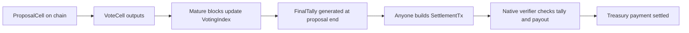

# Native On-chain Voting Settlement Design

状态: Draft

本文档描述一个不依赖 zkVM 的 CKB 原生链上投票结算设计。它以
`ckb-vote-poc` 的 ProposalCell / VoteCell / SettlementTx 模型为基础，
但把 zk proof 的验证路径替换为节点内部确定性的 tally index 和 native
settlement verifier。

一句话概括:

> Proposal 和 Vote 仍然是链上的 cell；每个 full node 从 canonical blocks
> 本地派生同一份 `VotingIndex`；任何人都可以提交 settlement tx；节点在交易
> 验证阶段用 `VotingIndex` 验证 settlement 结果和 treasury payout 是否正确。

这里最关键的一点是: `VotingIndex` 不需要在节点之间同步。节点之间同步的是区块。
`VotingIndex` 是每个节点从 canonical chain 派生出来的本地 chainstate cache，
类似 live cell set。它的数据库文件不是共识对象，但它的状态转移规则是共识规则。

## 1. 背景

当前 `ckb-vote-poc` 的设计使用 SP1 zkVM 来证明一段区块范围内的 tally 是正确的。

PoC 的核心结构是:

- `ProposalCell` 表示一个 proposal，出现在链上之后开始投票窗口。
- `VoteCell` 表示一次投票意图。
- Vote weight 来自 Nervos DAO deposit cell 的 capacity。
- voter identity 是 voter lock script 的 hash。
- 同一个 voter 后来的 vote 会覆盖之前的 vote。
- 如果 vote 引用的 DAO deposit 在投票窗口结束前被花费，该 vote 会被失效。
- 投票窗口结束后，任何人都可以生成 zk proof。
- Proposal type script 验证 proof 和 public values，proposal passed 后允许
  settlement。

zkVM 解决的是 CKB 普通 script 的一个基本限制: CKB-VM script 无法扫描任意历史区块。
script 只能看到当前交易局部视图，包括 inputs、outputs、witnesses、cell deps、
header deps 和 resolved cells。它不能问节点: “从 block A 到 block B 之间所有
vote cell 是什么？”

因此，如果不使用 zkVM，要做 permissionless tally settlement，必须把 tally
验证放到别的地方:

1. Settlement tx 携带所有相关 vote 数据，由 script 线性验证。
2. 每次 vote 都更新一个 on-chain state cell，settlement 读取最终 state。
3. 采用 optimistic tally 加 challenge period。
4. 节点实现 native consensus verifier，并维护确定性的 voting index。

本文档聚焦第 4 条路线。

## 2. 设计目标

### 2.1 功能目标

- 任何人都可以创建 proposal，但必须满足协议参数限制。
- 任何人都可以创建 vote cell 来投票。
- voter 可以在投票窗口内更新或撤回投票。
- 投票窗口结束并经过确认延迟后，任何人都可以提交 settlement tx。
- 每个 full node 都可以本地验证 settlement result 是否正确。
- tally result 必须在所有 honest full nodes 上完全一致。
- 不依赖可信 tally operator。
- 防止同一份 DAO-backed stake 被重复计票。
- settlement path 必须同时验证 tally correctness 和 treasury payout
  correctness。

### 2.2 共识目标

Settlement validity 必须是以下输入的确定性函数:

- consensus parameters；
- canonical blocks；
- verification snapshot，也就是待验证交易所在位置之前的链状态；
- transaction 本身。

派生的 voting state 必须可以从 canonical blocks 重建。reorg、rollback、
storage schema 和参数升级都必须有明确规则。

这个方案不是 soft fork。native verifier 会改变交易和区块有效性，因此需要
hardfork-style activation。

### 2.3 工程目标

- Settlement verification 应该是 O(1) 或接近 O(1)，不能在 settlement 时扫描
  历史区块。
- block processing overhead 必须有上界。
- storage growth 必须被 protocol limits 和 retention rules 限制。
- 节点应该提供足够的 RPC/debug 接口，方便 wallet、explorer 和 settlement
  builder 使用。

## 3. 非目标

- 不让普通 CKB-VM script 查询任意历史状态。
- 不保持旧节点兼容。旧节点不实现 native verifier，就不能正确验证升级后的链。
- 不提供 private voting。VoteCell 是公开数据。
- 不解决 treasury creation。treasury creating 和 voting settlement 是两个独立系统。
- 不要求节点之间同步 voting database。节点只同步区块，本地派生 voting database。

## 4. 总体架构

zkVM proof 路径被替换成节点原生组件:

```text
Canonical blocks
      |
      v
Mature block processing
      |
      v
VotingIndex
      |
      v
Native settlement verifier
      |
      v
Accept or reject settlement tx
```

也可以画成生命周期:



系统分三层:

1. 链上对象:
   - `ProposalCell`
   - `VoteCell`
   - `SettlementTx`
   - treasury cells 或 treasury outputs，取决于 treasury subsystem

2. 节点派生状态:
   - proposal records
   - 每个 proposal 下每个 voter 的 latest vote
   - DAO outpoint reverse index
   - finalized tally records
   - reorg undo records

3. 原生共识规则:
   - 识别 native voting proposal script
   - 验证 proposal creation 参数
   - 更新 `VotingIndex`
   - 验证 settlement transaction
   - 验证 treasury payout 规则

## 5. Native script identity

用户最初的直觉是设定一个特殊 proposal type script 值，例如 `0xAAAA...AAAA`。
这个方向是对的，但 production design 不应该使用非正式 magic value，而应该定义一个
consensus-owned native script identity。

示例:

```text
NativeVotingProposalTypeV1:
    code_hash = blake2b_256("ckb-native-voting-proposal-type-v1")
    hash_type = <reserved native hash type or protocol-defined interpretation>
    args      = <proposal unique id and optional versioned parameters>
```

有两种实现选择。

### 5.1 Reserved native hash type

引入一个保留的 `hash_type`，表示这个 script 不是 CKB-VM bytecode，而是节点原生实现。

优点:

- 语义清楚。
- 容易拒绝未知 native script version。

缺点:

- 扩展了 script 语义。
- activation 和兼容性处理更重。

### 5.2 Reserved code hash under existing hash type

保持现有 `Script` 结构，但在 activation 后让 script executor 识别一个保留
`code_hash`，遇到它时进入 native verifier。

优点:

- 数据模型改动较小。
- 表面上仍然是普通 CKB `Script`。

缺点:

- 语义不如 reserved hash type 显式。
- 需要避免和真实部署 script cell 的 code hash 混淆。

本文档后续统一称为 `NativeVotingProposalTypeV1`，不绑定具体编码。

## 6. 链上对象

### 6.1 ProposalCell

`ProposalCell` 表示一个 proposal。它被 include 到 canonical chain 之后，投票窗口开始。

推荐结构:

```text
ProposalCell:
    lock:
        always-success or protocol-defined proposal lock

    type:
        NativeVotingProposalTypeV1

    data:
        table NativeVotingProposal {
            version: Uint16,
            duration: Uint32,
            vote_cell_code_hash: Byte32,
            vote_cell_hash_type: Byte,
            description_hash: Byte32,
            description: Bytes,
            receiver: Script,
            amount_shannon: Uint64,
            minimal_requirement_shannon: Uint64,
            tally_rule: Uint16,
            treasury_policy: Uint16,
            settlement_window: Uint32,
        }
```

字段说明:

- `duration` 以 block 为单位。
- 投票窗口建议定义为 inclusive range:

```text
[start_number, start_number + duration]
```

- 因此窗口包含 `duration + 1` 个 block，和 PoC 保持一致。
- `amount_shannon` 是 proposal 请求的 treasury payout。
- `minimal_requirement_shannon` 是 turnout threshold，单位必须是 shannon。
- 所有共识金额字段都应该使用 shannon，避免 CKB / shannon 单位混用。
- `description_hash` 用于绑定较长描述或 off-chain metadata。
- `description` 如果保留在 cell data 中，必须有严格大小限制。
- `tally_rule` 是 tally 规则版本。
- `treasury_policy` 是 treasury payout 规则版本。
- `settlement_window` 用来限制 passed proposal 可 settlement 的时间，帮助控制状态保留。

Proposal id:

```text
proposal_out_point = OutPoint(tx_hash, output_index)
proposal_script    = ProposalCell.type
proposal_id        = blake2b_256(proposal_script)
vote_args          = blake160(proposal_script)
```

PoC 使用 proposal type script 的 blake160 作为 vote type script args。这个约定可以保留。

### 6.2 VoteCell

`VoteCell` 表示一次投票意图。vote type script 可以继续是普通 CKB-VM script。

推荐结构:

```text
VoteCell:
    lock:
        voter lock script

    type:
        code_hash = proposal.vote_cell_code_hash
        hash_type = proposal.vote_cell_hash_type
        args      = blake160(proposal_script)

    data:
        table Vote {
            vote: Byte,
            amount_shannon: Uint64,
            dao_index: Uint16Vec,
        }
```

规则:

- `vote = 0` 表示 NO。
- `vote = 1` 表示 YES。
- 其他值无效。
- `amount_shannon` 等于引用的 DAO deposit cell capacity 之和。
- `dao_index` 指向 `cell_deps` 中的 DAO deposit cells。
- 每个被引用的 DAO deposit cell 的 lock 必须等于 `VoteCell.lock`。
- `dao_index` 必须非空。
- `dao_index` 必须有最大长度限制。
- `dao_index` 中重复 outpoint 必须无效。
- v1 建议禁止 `dep_group`，只接受直接 `cell_dep`。

普通 vote type script 仍然有价值:

- 在交易进入区块前拒绝明显 malformed vote。
- 验证 voter 确实控制对应 lock。
- 保持 vote creation 大部分逻辑在 CKB-VM 层。

但是 native index 不能完全信任 vote type script。因为 proposal 里可以指定
`vote_cell_code_hash/hash_type`，节点在计票时仍然要独立解析和验证自己依赖的字段。

v1 更保守的选择是把 `vote_cell_code_hash/hash_type` 做成 protocol allowlist，
只允许官方 vote script。这样更容易保证所有 proposal 使用同一套 vote semantics。

### 6.3 SettlementTx

`SettlementTx` 消费一个 passed `ProposalCell`，并执行 treasury payout。

推荐形状:

```text
Inputs:
    ProposalCell
    TreasuryCell(s) or other treasury-controlled inputs
    Optional fee payer inputs

Outputs:
    Receiver payment cell
    Treasury change cell(s)
    Optional fee payer change

Witness:
    NativeVotingSettlementWitness {
        proposal_id: Byte32,
        start_number: Uint64,
        start_block_hash: Byte32,
        end_number: Uint64,
        end_block_hash: Byte32,
        yes_shannon: Uint64,
        no_shannon: Uint64,
        total_shannon: Uint64,
        passed: Byte,
        tally_rule: Uint16,
    }
```

这个 witness 是 claim，不是 proof。节点会把每个字段和本地 `VotingIndex` 中的
`FinalTally` 对比。

保留 witness 的好处:

- settlement builder 明确表达自己要 settle 哪个结果；
- wallet 和 explorer 容易展示；
- native verifier 可以给出更精确的 mismatch error；
- 方便 debug。

理论上也可以允许 empty witness，直接从 index 读取全部字段。v1 建议保留显式 witness。

## 7. 确认延迟和 off-by-one 规则

定义:

```text
K = voting_confirmation_depth
```

节点只把 mature block 加入 `VotingIndex`:

```text
mature_tip_number = chain_tip_number - K
```

一个 block 在本地 tip 达到 `block_number + K` 后，才会被 voting index 处理。

对于 proposal:

```text
start_number = block number containing ProposalCell output
end_number   = start_number + duration
```

当本地 tip 满足:

```text
tip_number >= end_number + K
```

节点已经可以完成该 proposal 的 final tally。此时 mempool 可以接受 settlement tx。

但是区块验证要更精确一点: 交易验证通常基于待验证区块的 parent snapshot，而不是把候选区块本身先计入 voting index。因此，如果 settlement tx 被打包进区块 `B`，推荐规则是:

```text
parent(B).number >= end_number + K
```

等价地，最早可打包 settlement 的区块高度是:

```text
settlement_block_number >= end_number + K + 1
```

这避免了一个 off-by-one 和候选区块循环依赖问题。钱包侧可以理解为:

1. 当本地 tip 到达 `end + K`，settlement tx 可以进入 mempool。
2. 它最早会被打包到下一个区块。

`K` 可以大幅减少普通 reorg 对 voting index 的影响，但不能消除 deep reorg。
deep reorg 仍然可能改变已经 mature 的 block，所以 rollback/rebuild 规则仍然是共识实现的一部分。

## 8. VotingIndex 是什么

`VotingIndex` 是本地派生 chainstate。

它具有这些性质:

- deterministic；
- 可以从 canonical blocks 重建；
- 在 block connect 时更新；
- 在 block detach / reorg 时回滚；
- 不通过 p2p 网络同步；
- 不暴露给普通 CKB-VM script 查询。

它和 live cell set 类似: 节点不会互相同步 live cell set 数据库，而是同步区块并本地计算。
不同之处是:

- live cell set 是 CKB cell model 的基础状态，几乎所有交易验证都依赖它；
- `VotingIndex` 是一个专门服务 native voting settlement 的派生状态。

### 8.1 为什么不网络同步也属于共识

数据库文件本身不是共识对象，但状态转移函数是共识对象。

如果 settlement validity 依赖:

```text
is_settlement_valid(tx, VotingIndex)
```

那么同一条 canonical chain 上所有 full node 必须计算出同一个 `VotingIndex`。

因此这些内容必须写进共识规则:

- index update order；
- proposal/vote parsing rules；
- malformed data handling；
- all resource limits；
- tally arithmetic；
- reorg rollback；
- storage schema version 和 migration；
- index corruption rebuild behavior。

## 9. VotingIndex 逻辑 schema

下面是逻辑 schema，不要求实现上一张表一个 column family。实际实现可以遵循 CKB
现有 RocksDB store 习惯。

### 9.1 VotingMeta

```text
VotingMeta {
    schema_version: Uint32,
    activation_number: Uint64,
    confirmation_depth: Uint64,
    indexed_mature_tip_number: Uint64,
    indexed_mature_tip_hash: Byte32,
    last_consensus_params_hash: Byte32,
}
```

用途:

- 记录 voting index 已处理到哪个 mature block；
- 检测 schema 或 consensus params mismatch；
- 支持 rebuild 和 migration。

### 9.2 ProposalRecord

Key:

```text
proposal_id -> ProposalRecord
```

Value:

```text
ProposalRecord {
    proposal_id: Byte32,
    proposal_out_point: OutPoint,
    proposal_type_script: Script,
    vote_args: Byte20,

    start_number: Uint64,
    start_block_hash: Byte32,
    start_tx_index: Uint32,
    start_output_index: Uint32,

    end_number: Uint64,
    duration: Uint32,

    vote_cell_code_hash: Byte32,
    vote_cell_hash_type: Byte,

    receiver: Script,
    amount_shannon: Uint64,
    minimal_requirement_shannon: Uint64,
    tally_rule: Uint16,
    treasury_policy: Uint16,
    settlement_deadline: Uint64,

    yes_shannon: Uint64,
    no_shannon: Uint64,

    status: ProposalStatus,
    finalized_number: Uint64,
    finalized_hash: Byte32,
}
```

Status:

```text
enum ProposalStatus {
    Active,
    FinalizedPassed,
    FinalizedRejected,
    Settled,
    Expired,
}
```

### 9.3 Proposal auxiliary indexes

```text
proposal_out_point -> proposal_id
vote_args          -> proposal_id
(end_number, proposal_id) -> ()
(settlement_deadline, proposal_id) -> ()
```

用途:

- 通过 vote args 找到 proposal；
- 在 mature processing 到达 `end_number` 时 finalize proposal；
- 在 settlement window 结束后 expire proposal。

### 9.4 VoteRecord

Key:

```text
(proposal_id, voter_id) -> VoteRecord
```

其中:

```text
voter_id = blake2b_256(voter_lock_script)
```

Value:

```text
VoteRecord {
    proposal_id: Byte32,
    voter_id: Byte32,
    voter_lock_hash: Byte32,
    voter_lock_script: Script,

    vote_out_point: OutPoint,
    vote_block_number: Uint64,
    vote_block_hash: Byte32,
    vote_tx_index: Uint32,
    vote_output_index: Uint32,

    direction: VoteDirection,
    amount_shannon: Uint64,
    dao_out_points: Vec<OutPoint>,

    active: Bool,
    invalid_reason: VoteInvalidReason,
}
```

```text
enum VoteDirection {
    No,
    Yes,
}

enum VoteInvalidReason {
    None,
    ReplacedByLaterVote,
    DaoSpentBeforeEnd,
    ProposalFinalized,
    Malformed,
}
```

每个 `(proposal_id, voter_id)` 最多只有一个 active vote。

### 9.5 DAO reverse index

Key:

```text
(dao_out_point, proposal_id, voter_id) -> ()
```

用途:

- 当 DAO deposit cell 被花费时，找到所有引用它的 active vote；
- 在投票窗口结束前让这些 vote 失效；
- 防止同一份 DAO stake 被 withdraw/redeposit 后重复计票。

当 voter 替换 vote 时必须:

1. subtract old vote from tally；
2. remove old vote 的 DAO reverse entries；
3. mark old vote as inactive / replaced；
4. insert new vote；
5. insert new DAO reverse entries；
6. add new vote to tally。

这个顺序可以避免 stale DAO reverse entry 之后错误地 invalidates 新 vote。

### 9.6 FinalTally

Key:

```text
proposal_id -> FinalTally
```

Value:

```text
FinalTally {
    proposal_id: Byte32,
    start_number: Uint64,
    start_block_hash: Byte32,
    end_number: Uint64,
    end_block_hash: Byte32,
    yes_shannon: Uint64,
    no_shannon: Uint64,
    total_shannon: Uint64,
    passed: Bool,
    tally_rule: Uint16,
    finalized_number: Uint64,
    finalized_hash: Byte32,
}
```

Settlement verification 读取 `FinalTally`，不重新扫描历史区块。

### 9.7 SettlementRecord

Key:

```text
proposal_id -> SettlementRecord
```

Value:

```text
SettlementRecord {
    proposal_id: Byte32,
    settlement_tx_hash: Byte32,
    settlement_block_number: Uint64,
    settlement_block_hash: Byte32,
}
```

live cell set 已经会防止同一个 `ProposalCell` 被消费两次。`SettlementRecord` 主要用于
RPC、debug、index integrity 和 explorer。

### 9.8 Undo log

Key:

```text
processed_block_hash -> VotingUndo
```

Value:

```text
VotingUndo {
    block_number: Uint64,
    block_hash: Byte32,
    previous_meta: VotingMeta,
    changed_records: Vec<UndoEntry>,
}
```

Undo log 用来处理 deep reorg。另一种方案是从 snapshot 或 activation block 重建。
重建逻辑必须存在，用于数据库恢复，但不适合作为唯一 reorg 策略。

## 10. Mature block processing

节点维护两个高度概念:

- `chain_tip_number`: 当前 canonical chain tip。
- `indexed_mature_tip_number`: voting index 已处理到的 mature block。

当 canonical tip 更新时:

```text
target_mature_tip = chain_tip_number - K

while indexed_mature_tip_number < target_mature_tip:
    next = indexed_mature_tip_number + 1
    process_mature_block(next)
```

如果当前 tip 小于 `K`，还没有任何 block mature。

### 10.1 Block 内处理顺序

对一个 mature block:

1. 按 transaction index 顺序遍历交易。
2. 对每个 transaction，先处理 inputs。
3. 再处理 outputs。

这个顺序有确定性，也符合直觉:

- 如果一笔 tx 花费了旧 vote 引用的 DAO deposit，并创建了新 vote，旧 vote 先被 invalidated；
- 然后新 vote 再被加入 tally。

### 10.2 处理 inputs

对每个 input:

```text
spent = input.previous_output
entries = DaoReverseIndex.lookup(spent)

for each (proposal_id, voter_id) in entries:
    proposal = ProposalRecord[proposal_id]

    if current_block_number <= proposal.end_number:
        vote = VoteRecord[(proposal_id, voter_id)]

        if vote.active:
            subtract_vote_from_tally(proposal, vote)
            vote.active = false
            vote.invalid_reason = DaoSpentBeforeEnd
            remove all DaoReverseIndex entries for vote.dao_out_points
```

如果 DAO deposit 在 `end_number` 之后被花费，不影响 final tally。规则是 DAO-backed
stake 必须保持 live 到投票窗口结束，而不是永远不能移动。

### 10.3 处理 proposal outputs

对每个 output:

```text
if output.type == NativeVotingProposalTypeV1:
    parse proposal data
    validate proposal creation constraints
    create ProposalRecord
    add auxiliary indexes
```

proposal creation constraints 至少应该包括:

- native proposal type id / unique id 正确；
- 每笔交易最多创建一个 native proposal，除非协议明确允许更多；
- `duration >= MIN_VOTING_DURATION`；
- `duration <= MAX_VOTING_DURATION`；
- `amount_shannon <= MAX_TREASURY_AMOUNT_PER_PROPOSAL`；
- `minimal_requirement_shannon >= MIN_TURNOUT`；
- `tally_rule` 是支持的版本；
- `treasury_policy` 是支持的版本；
- receiver script 编码合法；
- description size 不超过限制；
- vote script code hash/hash type 在 allowlist 中，或者符合协议规定；
- active proposal 数量不超过限制，或者 proposal 提供足够 deposit/bond。

### 10.4 处理 vote outputs

对每个 output:

```text
if output.type.args maps to an active proposal:
    proposal = ProposalRecord[proposal_id]

    if output.type.code_hash != proposal.vote_cell_code_hash:
        ignore

    if output.type.hash_type != proposal.vote_cell_hash_type:
        ignore

    if block_number < proposal.start_number:
        ignore

    if block_number > proposal.end_number:
        ignore

    parse Vote data
    validate Vote data and DAO references
    update latest vote for voter
```

不要对每个 cell 遍历所有 active proposal。应通过 `vote_args -> proposal_id` 做 O(1)
lookup。

### 10.5 更新 latest vote

给定一个有效的新 vote:

```text
key = (proposal_id, voter_id)
old = VoteRecord[key]

if old exists and old.active:
    subtract_vote_from_tally(proposal, old)
    remove DaoReverseIndex entries for old.dao_out_points
    old.active = false
    old.invalid_reason = ReplacedByLaterVote

insert new VoteRecord as active
insert DaoReverseIndex entries for new.dao_out_points
add_vote_to_tally(proposal, new)
```

tally helper:

```text
add_vote_to_tally(proposal, vote):
    if vote.direction == Yes:
        proposal.yes_shannon += vote.amount_shannon
    else:
        proposal.no_shannon += vote.amount_shannon

subtract_vote_from_tally(proposal, vote):
    if vote.direction == Yes:
        proposal.yes_shannon -= vote.amount_shannon
    else:
        proposal.no_shannon -= vote.amount_shannon
```

所有 arithmetic 必须 checked。overflow / underflow 代表 index corruption 或共识 bug，
不能 silent wrap。

### 10.6 Finalize proposal

当 mature processing 处理完高度 `N` 的 block 后，finalize 所有:

```text
proposal.end_number == N
```

计算:

```text
total = yes_shannon + no_shannon
passed = apply_tally_rule(
    tally_rule,
    yes_shannon,
    no_shannon,
    total,
    minimal_requirement_shannon
)
```

v1 可以沿用 PoC 的规则:

```text
passed =
    yes_shannon > no_shannon &&
    yes_shannon + no_shannon > minimal_requirement_shannon
```

需要明确一个 open question: `minimal_requirement` 使用 `>` 还是 `>=`。这个必须进入
`tally_rule` 版本，不能留给实现自行解释。

## 11. Vote validation 细节

Native index 只统计满足所有共识关键条件的 vote。

### 11.1 Proposal binding

vote 必须绑定到唯一 proposal:

```text
vote_type.args == blake160(proposal_type_script)
```

proposal 必须在 vote block 时处于 active 状态。

### 11.2 Voter identity

voter identity:

```text
voter_id = blake2b_256(vote_output.lock)
```

含义:

- 同一个 lock script 后来的 vote 覆盖前面的 vote。
- 用户可以把 stake 拆到多个 lock script 下分别投票。
- 这在 stake-weighted voting 下是可以接受的，因为权重来自 DAO stake，不来自地址数量。

### 11.3 DAO-backed weight

对 `dao_index` 中每个 entry:

1. index 指向一个 `cell_dep`；
2. v1 不支持 dep group；
3. resolved cell 存在；
4. resolved cell type 是 Nervos DAO；
5. resolved cell lock 等于 `VoteCell.lock`；
6. resolved cell 是 DAO deposit cell；
7. 同一个 vote 内 outpoint 不重复。

然后验证:

```text
sum(resolved_dao_cell.capacity) == vote.amount_shannon
```

如果失败，v1 有两个选择:

- 在 vote type script 中 reject，让 malformed vote 不能进块；
- native index defensive skip malformed vote-looking outputs。

推荐组合是两者都做:

- 官方 vote type script 尽量在 CKB-VM 层 reject；
- native index 仍然 deterministic skip 自己无法接受的数据。

这样即使某个 proposal 使用了有 bug 的 vote script，节点也不会因为 index parser panic 或
非确定行为而分叉。

### 11.4 DAO spend invalidation

如果 latest active vote 引用的任意 DAO deposit 在 `end_number` 之前或等于
`end_number` 被花费，整个 latest vote 失效。

这是 all-or-nothing 规则，和 PoC 目前模型一致。除非 vote data 记录每个 DAO deposit
的独立 amount，否则无法做 partial subtraction。

### 11.5 Same-block edge cases

v1 应该明确同块边界:

- block 内按 tx index 顺序处理；
- tx 内先 inputs 后 outputs；
- same-block vote 只有在交易本身按 CKB 依赖解析规则合法，并且处理到该 vote 时
  proposal 已知，才会被统计。

如果 same-block proposal-to-vote 语义过于微妙，wallet 可以简单等待一个 block 再投票。
协议仍然应该写清楚具体规则，不能依赖钱包约定。

## 12. Settlement verification

当交易消费一个带有 `NativeVotingProposalTypeV1` 的 `ProposalCell` 时，native script
executor 调用:

```text
verify_native_voting_settlement(tx, proposal_input_index, parent_snapshot, consensus)
```

注意这里使用 `parent_snapshot`。对于 mempool，则使用当前 tip snapshot。

### 12.1 基本检查

verifier 检查:

- proposal cell 在 tx 中被消费；
- proposal data 可以解析；
- proposal id 存在于 `VotingIndex`；
- index 中的 proposal record 和被消费的 proposal cell 完全匹配；
- 对于区块内交易，`parent(block).number >= end_number + K`；
- 对于 mempool 交易，`tip.number >= end_number + K`；
- proposal 已经有 `FinalTally`；
- `FinalTally.passed == true`；
- settlement deadline 未过；
- witness 字段和 `FinalTally` 完全一致；
- payout shape 符合 treasury policy。

live cell set 已经防止同一个 `ProposalCell` 被消费两次。native verifier 仍然应该对
duplicate proposal input 或异常 settlement shape 给出清晰错误。

### 12.2 Tally witness check

witness 必须满足:

```text
witness.proposal_id       == final_tally.proposal_id
witness.start_number      == final_tally.start_number
witness.start_block_hash  == final_tally.start_block_hash
witness.end_number        == final_tally.end_number
witness.end_block_hash    == final_tally.end_block_hash
witness.yes_shannon       == final_tally.yes_shannon
witness.no_shannon        == final_tally.no_shannon
witness.total_shannon     == final_tally.total_shannon
witness.passed            == final_tally.passed
witness.tally_rule        == final_tally.tally_rule
```

任何字段不一致，settlement tx 无效。

### 12.3 Treasury payout check

只验证 proposal passed 不够。settlement verifier 必须同时验证钱真的按 proposal
要求流向正确 receiver，并且 treasury change 没有被偷。

具体规则取决于 treasury subsystem。一个保守 v1 模型:

1. proposal 只授权从 treasury 支付 exactly `amount_shannon`。
2. settlement tx 必须创建 receiver output:

```text
receiver_output.lock     == proposal.receiver
receiver_output.type     == none
receiver_output.data     == empty
receiver_output.capacity == proposal.amount_shannon
```

3. treasury inputs 减去 receiver output 后，必须形成合法 treasury change。
4. treasury change 必须继承 treasury policy 需要的 metadata，比如 expiry、vintage、
   epoch 或 lookback 相关字段。
5. tx fee 默认由非 treasury fee payer inputs 支付。
6. 如果允许 treasury 支付 settlement fee，必须有明确上限和规则版本。
7. proposal cell 自身 occupied capacity 的处理方式也要明确: burn、fee、return 或进入
   treasury change。

这里的核心原则是: tally correctness 和 money movement correctness 必须绑定验证。
否则攻击者可以提交一个 tally 正确但 payout 错误的 settlement tx。

### 12.4 Failed proposal

如果 proposal finalized rejected:

- settlement 无效；
- `ProposalCell` 无法被 native type verifier 解锁；
- proposal cell 的 occupied capacity 可以作为 spam deterrent。

这和 PoC 中 “failed proposal cells cannot be recycled” 的方向一致。

如果未来希望清理 failed proposal，需要设计单独 failure-claim path，但这会削弱 spam
deterrent 并增加复杂度。

### 12.5 Expired passed proposal

如果使用 `settlement_window`:

```text
settlement_deadline = end_number + K + settlement_window
```

超过 deadline 后:

- settlement 无效；
- proposal 状态变成 `Expired`；
- 节点可以 prune 一部分 settlement-active 数据，但仍需保留 reorg 和 audit 所需数据。

这能避免 passed 但无人 settlement 的 proposal 永久占用 active state。

## 13. Reorg handling

confirmation delay 只是不处理最近 `K` 个区块，所以 shallow reorg 通常不会影响
`VotingIndex`。但 deep reorg 仍可能影响已经 mature 的 block。

节点必须支持:

1. detach old canonical branch；
2. 判断哪些 detached block 已经被 voting index 处理；
3. 按 reverse order rollback voting index；
4. attach new canonical branch；
5. 重新 advance mature voting index。

### 13.1 Undo log rollback

对每个 processed mature block 存 undo record。

deep reorg 时:

```text
while indexed_mature_tip is not ancestor of new_tip - K:
    undo(indexed_mature_tip)
    indexed_mature_tip -= 1

while indexed_mature_tip < new_tip - K:
    process next mature block on new canonical branch
```

### 13.2 Rebuild fallback

如果 undo log 缺失或损坏，节点必须能重建:

```text
delete VotingIndex
start from activation block
process mature blocks in canonical order
```

这较慢，但对数据库恢复很重要。

### 13.3 Settlement under reorg

如果一个 settlement tx 在旧分支上有效，但 deep reorg 改变了 `end_number` 之前的 vote
或 DAO spend，它在新分支上可能无效。

这是正常的。block validity 跟随 canonical branch 和该分支派生出的 chainstate。

## 14. Tx-pool 行为

tx-pool 必须调用和 block verification 相同的 native verifier。

规则:

- 当前 tip 未达到 `end + K` 时，mempool 拒绝 settlement。
- proposal 没有 `FinalTally` 时，拒绝 settlement。
- witness tally 字段错误，拒绝。
- treasury payout shape 错误，拒绝。
- chain tip 变化后 revalidate pending settlement tx。
- 如果 proposal cell 已被其他 tx 消费，evict competing settlement tx。

注意: mempool acceptance 不是共识。一个太早被 mempool 拒绝的 tx，未来可能变成有效。

## 15. RPC 和 tooling

建议提供只读 RPC 或内部 API:

```text
get_voting_proposal(proposal_id) -> ProposalRecord
get_voting_tally(proposal_id) -> current or final tally
get_voting_vote(proposal_id, voter_lock_hash) -> VoteRecord
get_voting_settlement_status(proposal_id) -> status
get_voting_index_tip() -> indexed mature tip
```

这些 API 不属于共识，但对可用性很重要。

Wallet 需要:

- proposal discovery；
- current tally preview；
- vote tx construction；
- replacement vote construction；
- settlement tx construction。

Explorer 需要:

- proposal state；
- final tally；
- settlement tx；
- rejected / expired state；
- vote history。

## 16. DoS 和资源限制

路线 1 最大的风险是让每个 full node 承担过多额外工作。

必须限制:

- active proposal 数量；
- proposal duration；
- settlement window；
- proposal data size；
- vote data size；
- 每个 vote 引用的 DAO dep 数量；
- 每个 block 可处理的 vote-looking cells；
- DAO reverse index entries 数量；
- undo data 保留量。

### 16.1 Proposal spam

攻击方式:

- 攻击者创建大量长周期 proposal；
- 节点必须维护大量 active proposal records。

缓解:

- `MAX_ACTIVE_PROPOSALS`；
- `MAX_VOTING_DURATION`；
- `MAX_SETTLEMENT_WINDOW`；
- proposal minimum capacity 或 burned deposit；
- 每个 block 的 proposal creation limit；
- treasury policy 对 amount 和 budget 做限制。

### 16.2 Vote spam

攻击方式:

- 攻击者创建大量 vote cells，并马上 recycle；
- vote cell 虽然不 live，但 index 仍需记录 latest vote 和 reverse index。

缓解:

- vote tx 仍要付交易费和占用 capacity；
- `MAX_DAO_DEPS_PER_VOTE`；
- 只解析 args 命中 active proposal 的 vote-looking output；
- 使用 `vote_args -> proposal_id` O(1) lookup；
- 替换 vote 时删除旧 reverse entries；
- proposal finalized / settled / expired 后按 retention rules prune。

### 16.3 DAO reverse index growth

攻击方式:

- 一个 vote 引用大量 DAO deposit；
- 每个 outpoint 都产生 reverse index entry。

缓解:

- 严格限制 `dao_index` 长度；
- 禁止重复 DAO outpoint；
- wallet 鼓励用户合并 voting stake；
- 可选地让 large DAO index 付更高成本。

### 16.4 Settlement spam

攻击方式:

- 攻击者反复提交错误 settlement tx。

缓解:

- final tally lookup 是 O(1)；
- witness mismatch 便宜 reject；
- payout shape 扫描当前 tx outputs 即可；
- 普通 relay fee policy 仍然适用。

### 16.5 Index corruption

风险:

- 本地数据库 bug 导致节点算出错误 index，进而拒绝有效区块或接受无效区块。

缓解:

- versioned schema；
- deterministic rebuild；
- debug integrity check；
- optional periodic index commitment logs；
- 对 malformed proposal/vote/witness 做 fuzz test；
- 对 reorg undo 做 property test。

## 17. Consensus parameters

示例参数:

```text
NativeVoting:
    activation_number: Uint64
    native_proposal_code_hash: Byte32
    native_proposal_hash_type: Byte
    confirmation_depth: Uint64

    min_voting_duration: Uint32
    max_voting_duration: Uint32
    max_settlement_window: Uint32
    max_active_proposals: Uint32

    max_description_size: Uint32
    max_dao_deps_per_vote: Uint16
    max_vote_cells_per_tx: Uint16
    max_native_proposals_per_tx: Uint16

    min_turnout_shannon: Uint64
    max_treasury_amount_per_proposal: Uint64

    supported_tally_rules: Vec<Uint16>
    supported_treasury_policies: Vec<Uint16>
```

这些参数不能是本地 node config。它们必须来自 consensus config 或 hardfork activation
规则。

## 18. CKB node 集成点

### 18.1 Store

需要新增 voting chainstate storage:

- proposal records；
- vote records；
- DAO reverse indexes；
- final tallies；
- settlement records；
- undo logs；
- metadata。

实现上可以新增 column family，也可以用 key prefix 放入既有 chainstate store。关键是
读写必须和 block connect/detach 保持原子性。

### 18.2 Chain attach/detach

block connect 时:

- 更新正常 chainstate；
- 根据新的 canonical tip advance mature voting index；
- 写入 undo records。

block detach 时:

- rollback 正常 chainstate；
- rollback 已 mature-indexed 的 voting changes。

VotingIndex 更新必须放在共识链状态路径上，不能放在 RPC indexer 或 optional service 中。

### 18.3 Transaction/script verification

script verifier 需要 native branch:

```text
if script == NativeVotingProposalTypeV1:
    NativeVotingVerifier::verify(...)
else:
    CkbVmScriptVerifier::verify(...)
```

Native verifier 需要访问:

- consensus params；
- parent snapshot / tx-pool snapshot；
- resolved transaction；
- `VotingIndex`；
- treasury policy checker。

### 18.4 Block verification

block verification 使用 parent snapshot 验证 block 内交易。settlement tx 是否有效取决于
parent snapshot 中已经 final 的 tally。

这也是为什么最早 settlement block 是 `end + K + 1`，而不是直接在 `end + K` 这个高度
里用候选区块自身给 end block 补确认。

### 18.5 Tx-pool

tx-pool 复用同一个 native verifier，但 snapshot 是当前 tip。

tip 变化后要 revalidate pending settlement tx，尤其是:

- proposal 刚刚 finalized；
- proposal cell 被消费；
- reorg 改变 final tally；
- settlement deadline 过期。

### 18.6 RPC

RPC 只暴露 read-only derived state。文档上应明确这些结果来自本节点的派生 index，
不是单独同步的网络状态。

## 19. 和 CKB 现有机制的关系

### 19.1 Live cell set

live cell set 记录当前所有未花费 cells。

相似点:

- 都从 canonical blocks 派生；
- 都存在本地数据库；
- 都不作为数据库对象在节点间同步；
- 都会影响交易或区块有效性。

区别:

- live cell set 是 CKB cell model 的通用基础；
- ordinary scripts 不直接查询整个 live cell set；
- VotingIndex 是针对 native voting settlement 的专用派生状态。

### 19.2 DAO state

DAO header field 也是有用的类比。

相似点:

- 节点根据区块计算 DAO 相关状态；
- 计算结果影响共识验证。

区别:

- DAO summary 被提交在每个 block header 的 `dao` field 中；
- v1 VotingIndex 不提交到 header；
- 因此 VotingIndex 的 transition rules 必须特别清晰，否则不同实现容易分叉。

未来可选扩展:

- 在 block header 中提交 voting state root 或 accumulator；
- 这样 light client verification 和 cross-node debugging 更容易；
- 但这是更大的协议改动，不是 v1 必需条件。

## 20. 和其他链的类比

这个设计本质上是 protocol-native module 或 native consensus rule。

类似机制包括:

- Bitcoin 的 UTXO set 和一些 native validation semantics；
- Cosmos SDK 的 `x/gov` 模块，所有节点执行同一个 application state transition；
- Substrate / Polkadot governance pallets，投票状态存在 runtime storage；
- Decred 的 ticket voting / agenda voting；
- CKB 的 DAO 计算，虽然 DAO summary 会进入 header。

它不像 EVM Governor contract。EVM contract 可以直接读写自己的 storage；CKB 普通 script
不能读全局历史状态，所以要么用 zk proof，要么把状态显式带进 cell，要么做 native
consensus extension。

## 21. 方案对比

### 21.1 保留 zkVM

优点:

- 不需要 voting native consensus state；
- proof 是 cryptographic 和 self-contained；
- 可复用于第三方系统。

缺点:

- prover dependency；
- zk toolchain 复杂；
- proof generation 有成本和延迟；
- on-chain verifier 复杂。

### 21.2 Settlement tx 携带全部 votes

优点:

- 纯 CKB script 可验证；
- 不需要 hardfork；
- 不需要 zk。

缺点:

- tx size 随 vote 数线性增长；
- 大 proposal 不可扩展；
- 历史 consumed vote cell 的证明携带困难；
- 用户体验差。

### 21.3 Incremental on-chain tally state cell

优点:

- 完全 script-verifiable；
- 没有 zk；
- 没有 native index。

缺点:

- singleton state cell bottleneck；
- 每次 vote 都要争用同一个状态；
- retraction 和 DAO spend invalidation 很复杂；
- 高并发体验差。

### 21.4 Optimistic tally + challenge

优点:

- 减少 native consensus 工作；
- anyone can submit result；
- 错误结果可以被挑战。

缺点:

- 需要 challenge game；
- settlement 延迟更长；
- 用户或 watchtower 必须监控；
- failure mode 更复杂。

### 21.5 Native VotingIndex

优点:

- 无 zk prover dependency；
- anyone can settle；
- settlement verification 便宜；
- full node 可以本地验证 tally；
- UX 接近普通链上 settlement。

缺点:

- 需要 hardfork/native consensus change；
- full node 负担增加；
- DoS limits 和 reorg handling 必须非常仔细；
- 复用性不如 zkVM proof。

## 22. 推荐 v1 规则

为了降低复杂度，v1 建议保持窄范围:

1. 一个 native proposal type version。
2. 一个 tally rule:

```text
yes > no && yes + no > minimal_requirement
```

3. voting weight 只来自 Nervos DAO deposit capacity。
4. voter identity 是 `blake2b(voter lock script)`。
5. 同一 voter 后来的 vote 覆盖前面的 vote。
6. DAO deposit 在 `end_number` 前或等于 `end_number` 被花费，则 latest vote 失效。
7. mempool 在 tip `>= end + K` 后接受 settlement。
8. block 中的 settlement tx 要求 parent tip `>= end + K`。
9. settlement 必须消费 proposal cell。
10. settlement 必须精确支付 proposal receiver 和 amount。
11. treasury change 必须保留 treasury policy metadata。
12. fee 默认由 settler / fee payer 支付，不从 treasury 中扣，除非有显式 fee policy。
13. passed proposal 有 settlement deadline。
14. failed proposal 默认不可回收。

## 23. 示例流程

### 23.1 创建 proposal

block 1000:

```text
ProposalCell created:
    duration = 100
    start_number = 1000
    end_number = 1100
    minimal_requirement = 5_000_00000000 shannons
    amount = 1_000_00000000 shannons
```

如果 `K = 24`，block 1000 会在本地 tip 到达 1024 后进入 voting index。

### 23.2 投票和替换

block 1010:

```text
Alice creates VoteCell:
    vote = YES
    amount = 2_000 CKB
    dao_index = [0, 1]
```

block 1020:

```text
Alice creates another VoteCell:
    vote = NO
    amount = 2_000 CKB
    dao_index = [0, 1]
```

当 block 1020 mature 后，Alice 的 YES vote 被 subtract，NO vote 被 add。

### 23.3 DAO spend invalidation

block 1050:

```text
Alice spends one referenced DAO deposit.
```

当 block 1050 mature 后，Alice 的 latest active vote 被 invalidated，并从 tally 中扣除。

### 23.4 Finalize

当 mature processing 到达 block 1100:

```text
yes = 8_000 CKB
no = 2_000 CKB
total = 10_000 CKB
minimal_requirement = 5_000 CKB

passed = yes > no && total > minimal_requirement
       = true
```

节点写入 `FinalTally`。

### 23.5 Settlement

本地 tip 到达:

```text
tip >= 1100 + 24
```

时，mempool 可以接受 settlement tx。

该 tx 最早可被打包进:

```text
block 1125
```

因为 block 1125 的 parent 是 1124，已经满足 `parent.number >= 1100 + 24`。

SettlementTx:

```text
Inputs:
    ProposalCell
    TreasuryCell(s)
    FeePayerCell(s)

Outputs:
    receiver output with exactly 1_000 CKB
    valid treasury change
    fee payer change

Witness:
    FinalTally claim matching node index
```

每个 full node 用本地 `FinalTally` 和 treasury rules 验证该 tx。

## 24. 失败路径

### 24.1 提交错误 tally

如果 witness 写:

```text
yes = 9_000 CKB
```

但 `FinalTally` 是:

```text
yes = 8_000 CKB
```

settlement tx 无效。

### 24.2 tally 正确但 receiver 错误

proposal passed，但 tx 支付给其他 receiver，settlement tx 无效。

### 24.3 tally 正确但 amount 错误

proposal approved 1,000 CKB，但 tx 支付 1,001 CKB，无效。

支付 999 CKB 也应该无效，除非 treasury policy 明确允许 partial settlement。v1 建议
exact payment。

### 24.4 DAO 在 end 前被花费

vote 引用的 DAO deposit 在 `end_number` 前或等于 `end_number` 被花费，latest vote 失效。

### 24.5 DAO 在 end 后被花费

vote 引用的 DAO deposit 在 `end_number` 之后被花费，不影响 final tally。

### 24.6 Proposal passed 但无人 settlement

超过 `settlement_deadline` 后 proposal 过期，不能再 settlement。

如果不设置 settlement window，节点可能要永久保留 passed proposal settlement data，
这对 state growth 不友好。

## 25. 测试计划

### 25.1 Unit tests

测试纯 tally transition:

- add YES vote；
- add NO vote；
- replace YES with NO；
- replace NO with YES；
- spend DAO before end；
- spend DAO at end；
- spend DAO after end；
- duplicate DAO deps；
- malformed vote data；
- overflow / underflow；
- stale DAO reverse entry 不会影响新 vote。

### 25.2 Chain tests

构造区块序列:

- proposal creation；
- vote creation；
- vote replacement；
- vote recycling；
- DAO spend；
- finalization；
- settlement。

验证:

- index tip 只在 `K` confirmation 后前进；
- settlement 在 parent tip `< end + K` 时无效；
- settlement 在 parent tip `>= end + K` 时有效；
- wrong witness rejected；
- wrong receiver rejected；
- wrong amount rejected；
- treasury change policy enforced。

### 25.3 Reorg tests

覆盖:

- short reorg 小于 `K`，index 不变；
- deep reorg 替换 vote block；
- deep reorg 替换 DAO spend block；
- deep reorg 让 pass 变 fail；
- deep reorg 让 fail 变 pass；
- settlement 在旧分支有效但新分支无效。

### 25.4 Tx-pool tests

覆盖:

- too-early settlement rejected；
- proposal finalized 后 pending settlement 变有效；
- proposal cell 被消费后 competing settlement evicted；
- reorg 后 pending settlement revalidated；
- settlement deadline 过期后 evicted。

### 25.5 Fuzz tests

Fuzz:

- proposal molecule parser；
- vote molecule parser；
- settlement witness parser；
- DAO index vector；
- reverse index update sequence；
- undo log rollback sequence；
- treasury payout checker。

## 26. Light client 和审计性

v1 不把 `VotingIndex` root 提交进 header，因此 light client 不能只靠 header 验证
voting settlement tally。light client 有几种选择:

- 信任 full node RPC；
- 使用额外 proof 服务；
- 等未来版本把 voting state root / accumulator 放入 header 或其他 committed structure；
- 继续使用 zk proof 路线服务 light-client-friendly verification。

这不是 full node consensus 的 blocker，但需要在用户模型里说清楚。

## 27. Open questions

1. `minimal_requirement` 用 `>` 还是 `>=`？
2. NO vote 是否计入 turnout？PoC 当前规则使用 `YES + NO`。
3. same-block proposal 和 vote 是否应该计入？
4. failed proposal cells 是否永久锁定？
5. treasury 是否允许支付 bounded settlement fee？
6. 是否要在未来 header 中提交 voting state root？
7. proposal description 是完整上链，还是只上链 hash？
8. DAO vote weight 使用原始 deposit capacity，还是考虑 DAO compensation？
9. settlement 是否必须 exact-only，还是允许 partial settlement？
10. CKB mainnet 上合理的 `K` 应该是多少？
11. `vote_cell_code_hash/hash_type` 是否固定 allowlist，还是允许 proposal 自定义？
12. expired passed proposal 的历史数据保留多久？

## 28. 总结

去掉 zkVM 是可行的，但不能仍然期待普通 CKB script 自己验证历史 tally。必须把 tally
验证放到另一个机制里。

本文推荐的路线是 native voting index:

- proposal 和 vote 仍然以 cell 形式上链；
- 每个 full node 从 canonical blocks 派生 `VotingIndex`；
- `VotingIndex` 不网络同步，但 transition rules 是共识规则；
- ordinary scripts 不查询 `VotingIndex`；
- native proposal type script 在交易验证时读取 `FinalTally`；
- settlement tx 由任何人提交；
- 节点同时验证 tally correctness 和 treasury payout correctness；
- reorg、DoS limits、storage retention 和 activation 都作为协议设计的一部分。

这样可以保留我们想要的性质: 任何人都能帮助 tally 和 settlement，但任何 full node 都能
独立验证结果是否正确，不依赖 zk prover，也不依赖中心化 tally operator。
